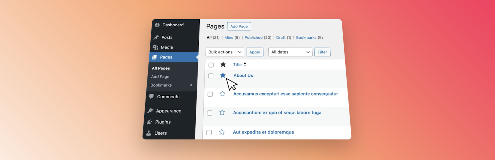
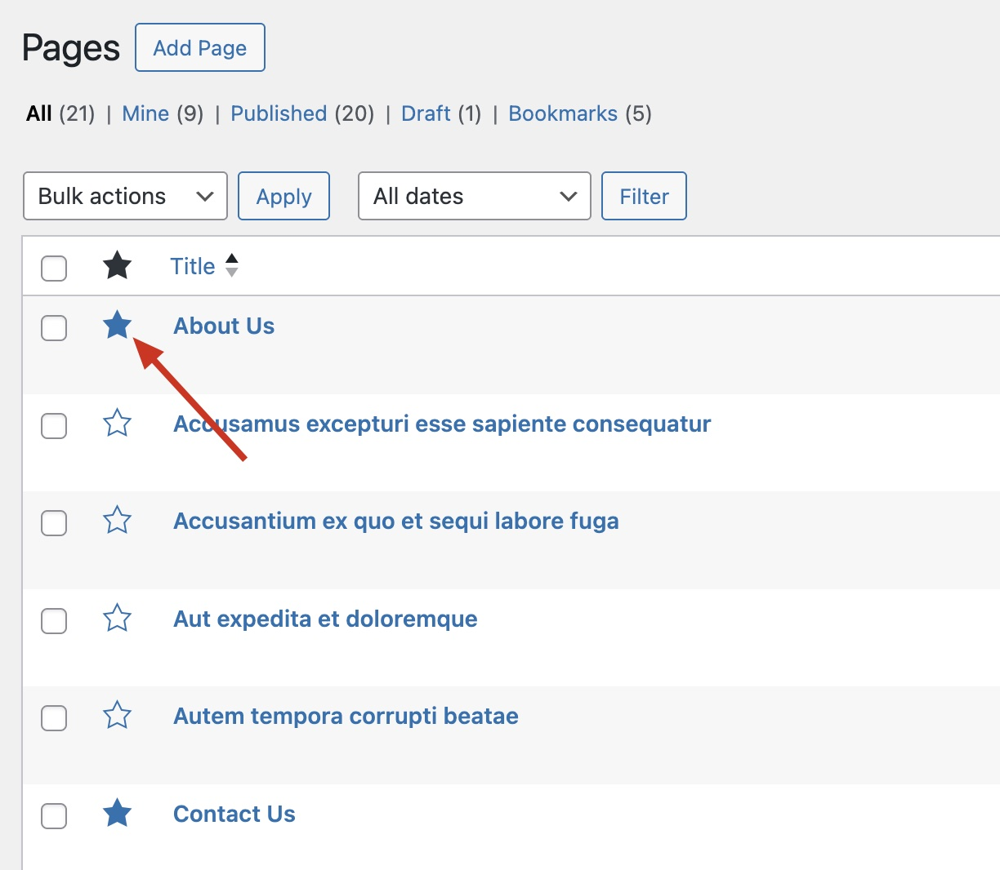
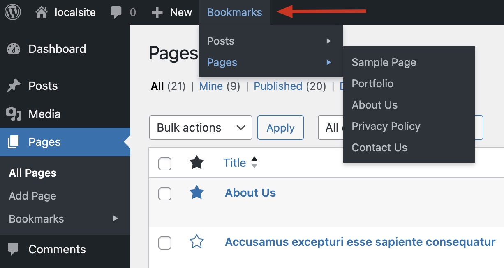
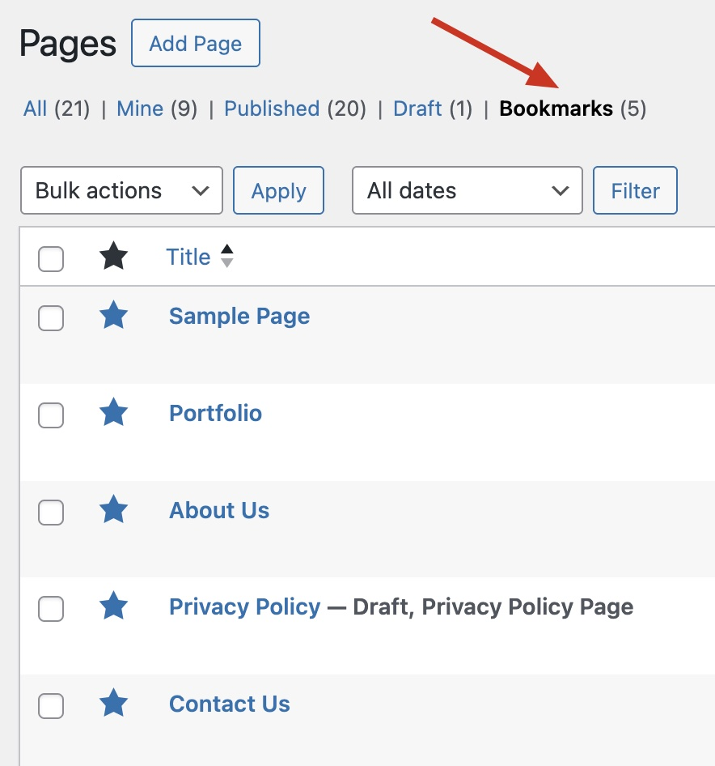
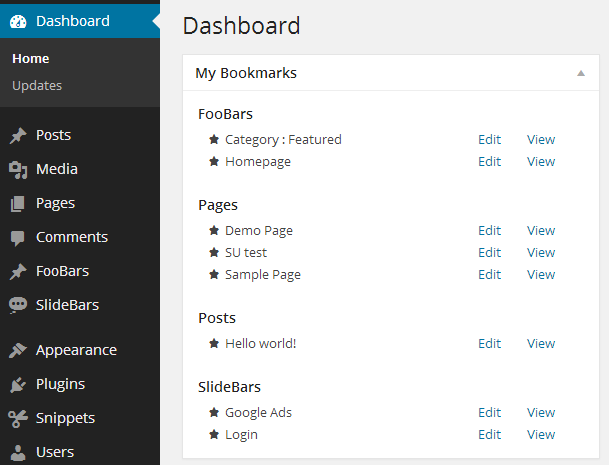
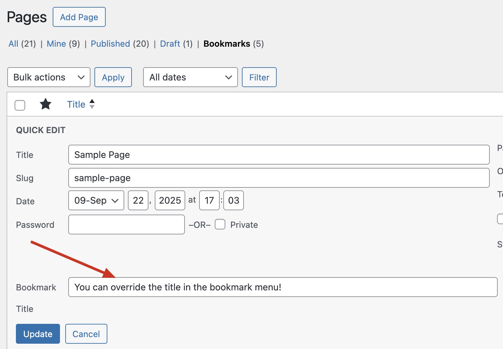

# Admin Bookmarks

**Contributors:** bradvin  
**Tags:** admin, shortcut, bookmark, bookmarks, favorites  
**Requires at least:** 3.8  
**Tested up to:** 6.8  
**Stable tag:** 2.0.0

Bookmark your favorite posts, pages or custom post types within the WordPress admin.

## Description

This plugin allows you to easily bookmark/favorite posts, pages and custom post types. When you “star” a post a shortcut link will appear in the admin menu. Use this plugin if you constantly find yourself editing the same posts or pages, and are sick of loading the list first, then finding the post, then clicking edit.

### Steps to use

1. Go to Pages.
2. Click the star icon on a page.
3. Your page is now bookmarked!
4. Repeat for other frequently edited content.
5. Save time!

### Plugin Features

- Intuitive interface to bookmark posts using a star icon.
- Zero settings! Activate and enjoy.
- Works with posts, pages and any custom post types.
- Dashboard widget listing all bookmarks.
- Setting a bookmark is done in realtime with no page reload.
- Bookmarks are added to the admin menu for quick access.
- Filter lets you control which post types expose bookmarks.
- Optional “Bookmark Title” quick edit field to customize menu labels.
- Bookmark shortcuts are grouped by post type within the WordPress admin bar.

### Filters

- `admin_bookmarks_post_types` – Scope bookmarks to specific post types.
- `admin_bookmarks_untitled_label` – Customize the label used when a post lacks a title.
- `admin_bookmark_feature-dashboard_widget` - Filter to disable the dashboard widget
- `admin_bookmark_feature-quick-edit` - Filter to disable the quick edit feature
- `admin_bookmark_feature-view` - Filter to disable the view feature
- `admin_bookmark_feature-admin-bar` - Filter to disable the admin bar feature

## Installation

1. Upload the plugin folder `admin-bookmarks` to your `/wp-content/plugins/` directory.
2. Activate the plugin through the **Plugins** menu in WordPress.
3. Click on the **Pages** menu item to view the list of pages and start bookmarking!

## Screenshots

1. New bookmark column  
   
2. Bookmarks added to admin menu  
   
3. Bookmarks in Admin Bar  
   
4. Bookmarks View  
   
5. Dashboard bookmarks widget  
   
6. Override title used for bookmark  
   

